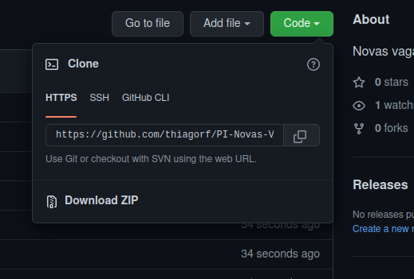

# PI-Novas-Vagas-Backend (WIP)

[frontend repo](https://github.com/thiagorf/PI-Novas-Vagas-Frontend)

## Future features

File storage with Filebase (Decentralized Storage)
>Just to test it


Use files to create resources
>For example, create resources based on rows in excel file probably with a stream

Produce PDF reports.

## How to Run

Download or clone the project in github page



run the command ```git clone (repository url)```

change the ```.example.env ``` file to ```.env``` and replace the properties based on your enviroment.

```npm run dev``` or ```yarn dev``` to run the project

